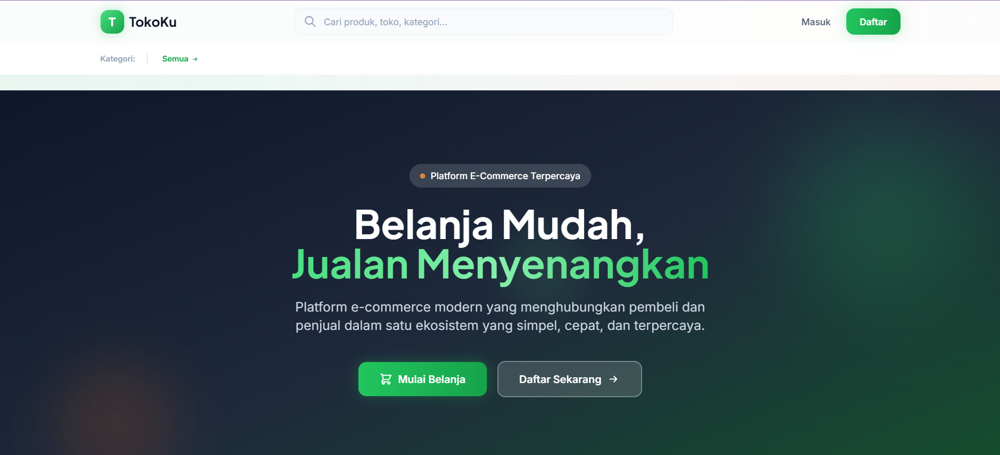
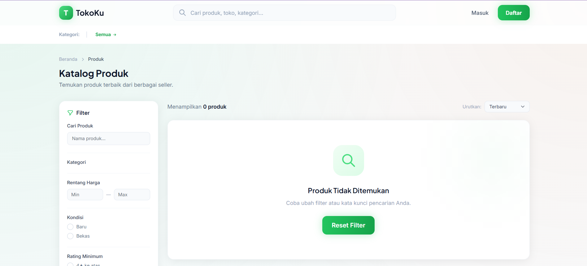

# TokoKu — E-Commerce Platform

[](https://laravel.com)
[](https://php.net)
[](https://tailwindcss.com)
[]()
[](LICENSE)

Platform e-commerce **multi-role** (Buyer, Seller, Admin) dengan homepage modern, fitur transaksi lengkap, dan keamanan yang kuat. Dibangun sebagai proyek portofolio menggunakan Laravel 12, Tailwind CSS, dan Alpine.js.

**Status:** MVP Lengkap — Fase 1, 2, 3 selesai. Siap untuk demo atau soft launch.

## Demo

- **Live Demo:** [https://tokoku-demo.example.com](https://tokoku-demo.example.com) *(ganti dengan URL Anda)*
- **Screenshots:** [docs/screenshots/](docs/screenshots/)

## Tech Stack

- **Backend:** Laravel 12, PHP 8.2+
- **Frontend:** Tailwind CSS, Alpine.js, Blade Templates
- **Database:** MySQL (production) / SQLite (development)
- **Auth:** Laravel Breeze dengan multi-role (buyer, seller, admin)
- **Build Tool:** Vite

## Fitur MVP yang Tersedia

### Autentikasi & Pengguna
- Registrasi, login, logout dengan rate limiting
- Verifikasi email & reset password
- Multi-role: Buyer, Seller, Admin
- Middleware: role-based access, active user check, verified seller check
- Edit profil (nama, avatar, nomor HP)
- Ganti password
- Manajemen alamat pengiriman
- Daftar sebagai seller (dengan verifikasi admin)

### Katalog & Produk
- Homepage modern dengan banner slider, kategori, produk terlaris, flash sale, dan testimonial
- Katalog publik dengan filter (kategori, harga, kondisi, rating minimum) & sorting
- Halaman detail produk dengan produk terkait
- Halaman profil toko publik
- CRUD produk oleh seller dengan upload multiple foto (max 5)
- Bulk update stok oleh seller
- Filter & pencarian di tabel produk seller
- Aktifkan/nonaktifkan produk
- CRUD kategori oleh admin

### Transaksi
- Keranjang belanja (tambah, update qty, hapus)
- Checkout dengan pilihan alamat
- Manajemen pesanan (riwayat, detail, batalkan)
- Restorasi stok otomatis saat pesanan dibatalkan
- Seller dapat mengupdate status item pesanan (pending → paid → shipped → completed)

### Admin
- Verifikasi pendaftaran seller (approve/reject)
- Manajemen banner homepage
- Manajemen kategori
- Manajemen user (aktifkan/nonaktifkan)

### Keamanan
- CSRF protection di semua form
- XSS protection via Blade escaping
- Mass assignment protection yang ketat
- Ownership check di setiap resource sensitif
- File upload: tipe & ukuran dibatasi
- Rate limiting untuk auth & katalog produk

## Instalasi

```bash
# Clone repository
git clone https://github.com/USERNAME/tokoku.git
cd tokoku

# Install dependencies
composer install
npm install && npm run build

# Setup environment
cp .env.example .env
php artisan key:generate

# Database (SQLite untuk development)
php artisan migrate --seed

# Jalankan server
php artisan serve
```

## Demo Credentials

| Role  | Email              | Password   |
|-------|--------------------|------------|
| Buyer | buyer@tokoku.test  | password   |
| Seller| seller@tokoku.test | password   |
| Admin | admin@tokoku.test  | password   |

## Testing

```bash
php artisan test
```

Saat ini tersedia **75 test** dengan **165 assertions** yang mencakup autentikasi, katalog, keranjang, pesanan, produk seller, banner admin, dan profil.

## Screenshots

> Tambahkan screenshot ke folder `docs/screenshots/` dan update path di bawah.

| Homepage | Katalog Produk | Detail Produk |
|----------|----------------|---------------|
|  |  |  |

| Seller Dashboard | Kelola Produk | Checkout |
|------------------|-----------------|----------|
|  |  |  |

## Arsitektur

```
User (Buyer/Seller/Admin)
    │
    ▼
Laravel Routes → Middleware (Auth, Role, Active)
    │
    ▼
Controllers → Models → SQLite/MySQL
    │
    ▼
Blade Views + Tailwind CSS + Alpine.js
```

## Roadmap

- Fase 1 — Autentikasi & Profil ✅
- Fase 2 — Produk & Katalog ✅
- Fase 3 — Transaksi & Order ✅
- Fase 4 — Payment Gateway (Planned)
- Fase 5 — Dashboard Analytics & Laporan (Planned)

## Struktur Dokumentasi

- `docs/PRD_TokoKu_Ecommerce.md` — Product Requirements Document
- `docs/SITEMAP.md` — Sitemap & page hierarchy
- `docs/DESIGN.md` — Design system & guidelines

## License

MIT License
